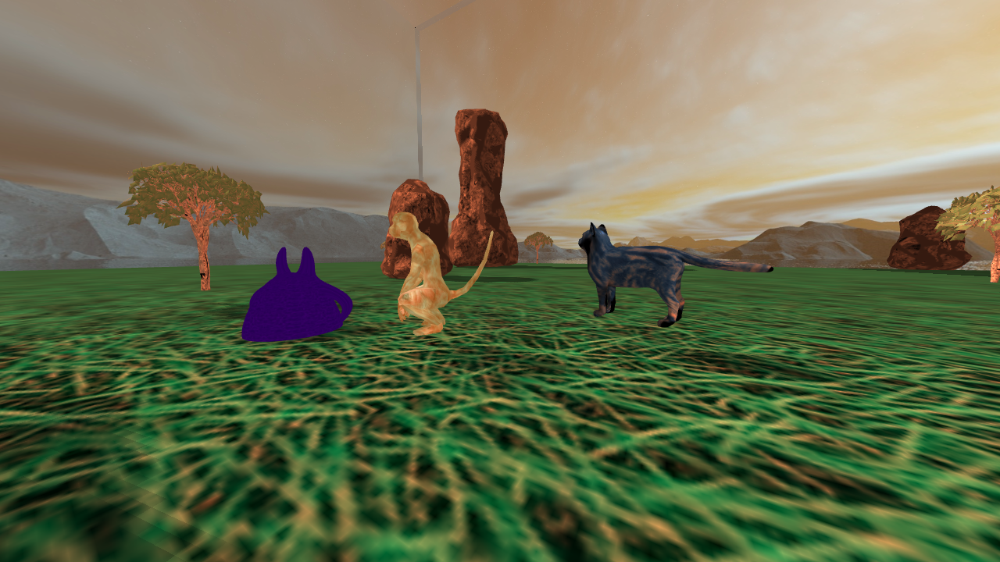

# Pokemon Project



## Dependencies 

* opengl
* tinyobjloader
* glfw
* glew

## Installation Instruction

### Linux

```bash
$ git clone https://github.com/Vagos/zino-engine
$ cd zino-engine && make
```
### Windows

```bash
$ git clone https://github.com/Vagos/zino-engine
$ cd zino-engine 
$ mkdir build
$ cmake ..
```

## Credits 

* Skybox obj: https://searchcode.com/codesearch/view/15424393/
* PokeBall obj: crew.christobel@mail.com  
* Star obj: https://free3d.com/3d-model/star-mobile-ready-60-tris-49986.html
* Monkey obj: http://www.cadnav.com
